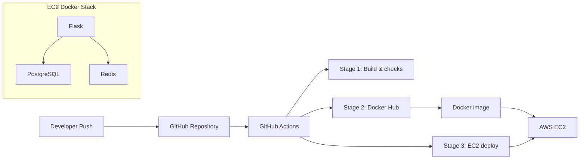

# ShieldGuard Pro

[](https://www.python.org/)
[](https://flask.palletsprojects.com/)
[](https://www.postgresql.org/)
[](https://www.docker.com/)
[](https://hub.docker.com/r/abhiishek25/shieldguard-pro)
[](https://github.com/abhishek-balsure/phishing-detector-pro/actions)
[](https://opensource.org/licenses/MIT)

ShieldGuard Pro is an enterprise-grade phishing detection platform powered by machine learning. It combines advanced URL analysis with comprehensive security features including OAuth authentication, real-time threat detection, and professional UI/UX.

## Live Links

- **Application**: [http://35.154.32.25:5000](http://35.154.32.25:5000)
- **Docker Hub**: [abhiishek25/shieldguard-pro](https://hub.docker.com/r/abhiishek25/shieldguard-pro)

## Core Features

- **ML-Powered Detection**: Random Forest model (selected over XGBoost via 5-fold cross-validation) trained on 1,964 labeled URLs. Model achieves 94.9% AUC-ROC with a custom high-precision threshold (0.65) to practically eliminate false positives on legitimate sites.
- **Premium UI/UX**: High-end Glassmorphism design system featuring animated threat level gauges, real-time scrolling activity feeds, and adaptive Dark Mode.
- **OAuth Authentication**: Seamless login with Google and GitHub using Flask-Dance.
- **Multi-Format Analysis**: URL, email, QR code, message, and social media link batch scanning.

## Architecture & Deployments

This project demonstrates two different deployment architectures within the same codebase to explore containerized vs. serverless tradeoffs:

### 1. AWS EC2 (Primary Deployment)
- **Host**: AWS EC2 `t3.micro` (Ubuntu 22.04, `ap-south-1`)
- **Pipeline**: 3-stage GitHub Actions CI/CD (Validate → Docker Hub → Auto-deploy via SSH)
- **Containerization**: Separate Docker Compose configurations for development vs. production (ensuring DB ports are not exposed in prod).
- **Incident Response**: Proven ability to handle live production incidents including disk-space exhaustion (`resize2fs`), memory pressure (swap configuration), and stale images with zero-downtime migrations.



### 2. AWS Lambda (Serverless Architecture)
- **Deployment**: Serverless AWS Lambda function containerized via Amazon ECR.
- **Access**: Exposed via a public Function URL for low-latency, scalable inference.

## Tech Stack

| Category | Technologies |
|---|---|
| **Backend** | Python 3.11, Flask 3.0, Gunicorn |
| **Machine Learning** | scikit-learn, XGBoost, NumPy, pandas |
| **Database & Cache** | PostgreSQL 15, Redis 7 |
| **Auth** | JWT, OAuth (Flask-Dance) |
| **DevOps** | Docker, Docker Compose, GitHub Actions, AWS EC2 |

## Quick Start (Docker)

To run the full production stack locally:

```bash
git clone https://github.com/abhishek-balsure/phishing-detector-pro.git
cd phishing-detector-pro
cp .env.example .env
docker-compose up --build -d
```
Open `http://localhost:5000`
