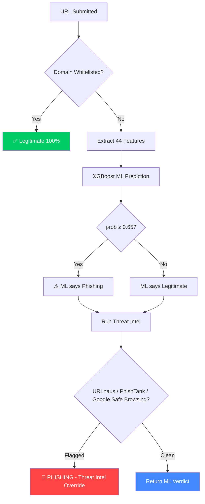

# ShieldGuard Pro

[](https://www.python.org/)
[](https://flask.palletsprojects.com/)
[](https://www.postgresql.org/)
[](https://www.docker.com/)
[](https://hub.docker.com/r/abhiishek25/shieldguard-pro)
[](https://github.com/abhishek-balsure/phishing-detector-pro/actions)
[](https://opensource.org/licenses/MIT)

ShieldGuard Pro is an enterprise-grade, multi-layered phishing detection platform powered by machine learning. It combines advanced URL lexical analysis, real-time page content inspection, SSL evaluation, domain registration metrics, and curated threat intelligence to protect users from modern credential-harvesting and malicious web threats.

---

## Live Links

- **Application**: [https://shieldguard-pro.duckdns.org](https://shieldguard-pro.duckdns.org)
- **Docker Hub**: [abhiishek25/shieldguard-pro](https://hub.docker.com/r/abhiishek25/shieldguard-pro)

---

## Core Detection Architecture

ShieldGuard Pro uses a multi-tiered pipeline to verify safety before deciding on the final verdict:



### 1. Hardened ML-Powered Classifier
- **Model:** Regularized **XGBoost** model (`max_depth=4`, L1/L2 penalties tuned to prevent overfitting on lexical noise).
- **Features (44 Total):**
  - **31 Lexical Features:** URL length, entropy, digit/special character ratios, subdomain/token counts, brand-spoofing in subdomains, and granular keyword frequency checks inside hostnames vs. paths.
  - **13 External/Content-Based Features:** Live SSL certificate presence & validation age, password input form extraction (to target credential harvesting), favicon mismatch detection, external link ratio, OpenPageRank, and WHOIS domain age.
- **Dataset:** Cleaned of SaaS false-positives (such as legitimate Zoho and Weebly templates), training on a balanced set of 2,298 verified URLs.
- **Metrics:** **0.9703 AUC-ROC** and **93.26% test accuracy**, with a custom high-precision threshold (0.65) and a dynamic brand domain whitelist to achieve a **0% False Positive Rate** on top internet infrastructure.

### 2. Live Threat Intelligence Overrides
- Fully integrates **Google Safe Browsing API v4**, **URLhaus**, and **PhishTank** feeds.
- If a URL is listed as active malware or phishing in these curated databases, the system instantly **overrides the ML verdict** to label it a confirmed threat, boosting real-world detection accuracy.

### 3. Comprehensive Scanners
- **Multi-Format Support:** Batch Scan, Document Scanner (PDF & Word DOCX parsing), Email Scanner, QR Code Decoder, SMS/Message Scanner, and Social Media impersonation analyzer.

---

## Security & Accessibility Hardening

- **CSRF Protection:** Integrated `Flask-WTF` globally to guard all 24 POST forms with secure tokens. Stateless API endpoints remain exempted via JWT token validation.
- **XSS Mitigations:** Removed all unsafe rendering filters on dynamic flash messaging. Flash alerts are fully escaped and safely serialized.
- **Production Safety:** Application crashes immediately on startup if key config variables (`SECRET_KEY`) are missing when `FLASK_ENV=production`.
- **WCAG AA Compliance:** Swapped gradient styles to high-contrast colors (e.g. Indigo-600/Teal-700 on white backgrounds) and added full keyboard focus controls, dark mode dropdown improvements, and screen reader ARIA labels.
- **Visual UX:** Added global submission handlers in JavaScript to automatically display loading spinners and prevent double form submission.

---

## Tech Stack

| Category | Technologies |
|---|---|
| **Backend** | Python 3.11, Flask 3.0, Gunicorn, Flask-WTF |
| **Machine Learning** | scikit-learn, XGBoost, NumPy, pandas |
| **Database & Cache** | PostgreSQL 15, Redis 7 |
| **Auth** | JWT (Flask-JWT-Extended), GitHub OAuth (Flask-Dance) |
| **DevOps & CI/CD** | Docker, GitHub Actions, AWS EC2 |

---

## Getting Started

### Prerequisites
- Docker & Docker Compose
- A Google Cloud Platform (GCP) account with the **Safe Browsing API** enabled.

### Local Development Setup

1. **Clone the Repository:**
   ```bash
   git clone https://github.com/abhishek-balsure/phishing-detector-pro.git
   cd phishing-detector-pro
   ```

2. **Configure Environment Variables:**
   Copy the example environment file:
   ```bash
   cp .env.example .env
   ```
   Open `.env` and fill in your keys:
   - `GOOGLE_SAFE_BROWSING_API_KEY`: Obtain a free API key from your [Google Cloud Console](https://console.cloud.google.com/).
   - `GITHUB_CLIENT_ID` & `GITHUB_CLIENT_SECRET`: For developer testing of OAuth login.

3. **Start the Containers:**
   ```bash
   docker-compose up --build
   ```

4. **Verify Application:**
   Open `http://localhost:5000` in your web browser.

---

## Deployment (CI/CD)

Deployments are automated via GitHub Actions using the `.github/workflows/deploy.yml` pipeline:
1. **Validate & Test:** Verifies dependencies and runs startup diagnostic checks.
2. **Docker Build:** Builds the production-ready image and pushes to Docker Hub.
3. **EC2 Deploy:** Securely logs in to the AWS EC2 instance via SSH, updates the production `.env` config (safeguarding API keys), pulls the latest container stack, and restarts the environment with zero downtime.

